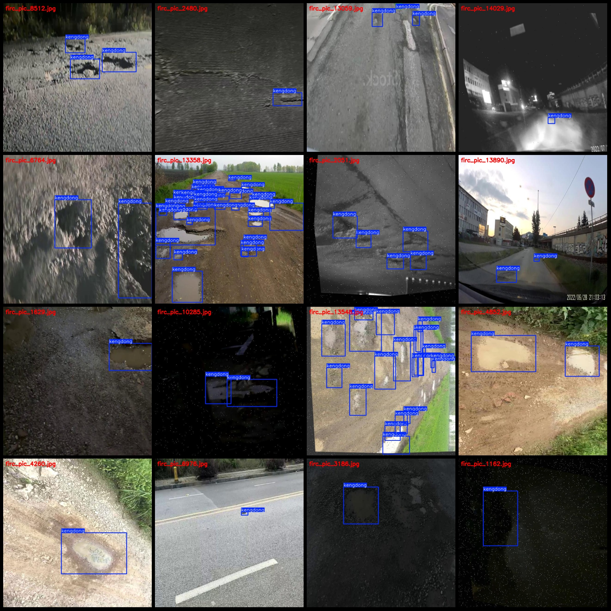
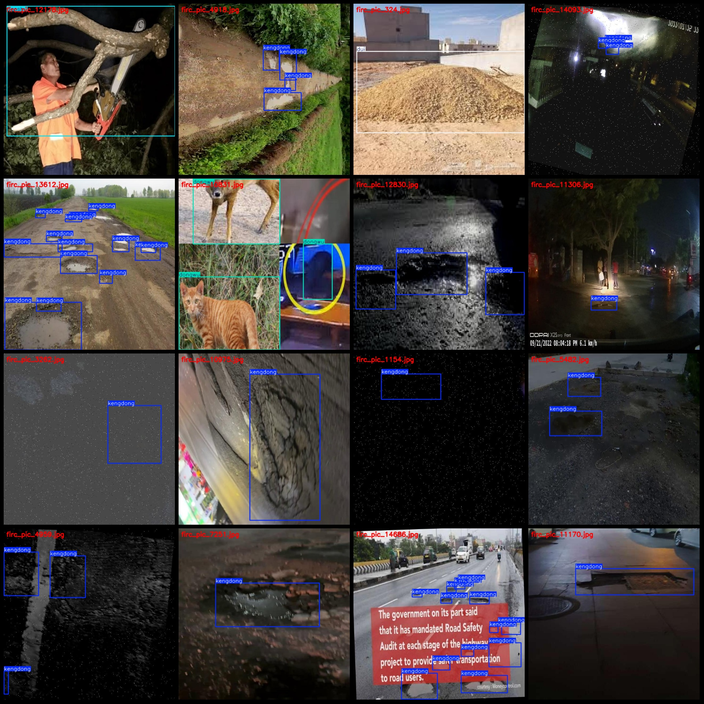

# Road Obstacle Detection Dataset VOC+YOLO Format with 14844 Images in 4 Categories with Enhanced

Please note that the dataset contains a large number of enhanced images, which can be seen by viewing the images.
The dataset format: Pascal VOC format + YOLO format (excluding the split path in txt files, only containing jpg images as well as corresponding VOC format xml files and yolo format txt files)
Number of images (jpg file count): 14844
Number of labels (xml file count): 14844
Number of labels (txt file count): 14844
Number of categories: 4
Label names (notice that the order of labels in yolo format does not correspond to this, but is based on the "labels" folder's "classes.txt"): ["daoshu", "dongwu", "dui", "kengdong"]
Chinese category names corresponding to these labels: ["overturned tree", "animal", "heap", "pit"]
Number of bounding boxes for each category:
- daoshu bounding box count = 1075
- dongwu bounding box count = 2342
- dui bounding box count = 400
- kengdong bounding box count = 34520
Total bounding box count: 38337
Number of images per category:
- daoshu image count = 830
- dongwu image count = 892
- dui image count = 280
- kengdong image count = 12842
Image resolution: 640x640
Annotation tool used: labelImg
Annotation rules: draw bounding boxes for categories
Important Notice: The dataset does not have been divided into training, validation, or test sets; you need to divide it yourself.
Special Disclaimer: This dataset does not guarantee any accuracy in the trained models or weights files.
Image Preview:

## Images

Here is a pay link on Stripe ( https://buy.stripe.com/3cs8yP7sY87d0vu9AB ). Please contact me lonlonago@foxmail.com after funding $89, and I will send you a complete data files , thank you!

